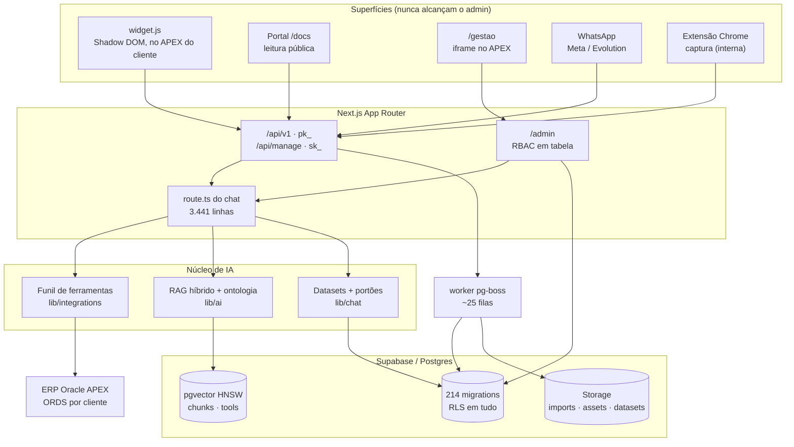
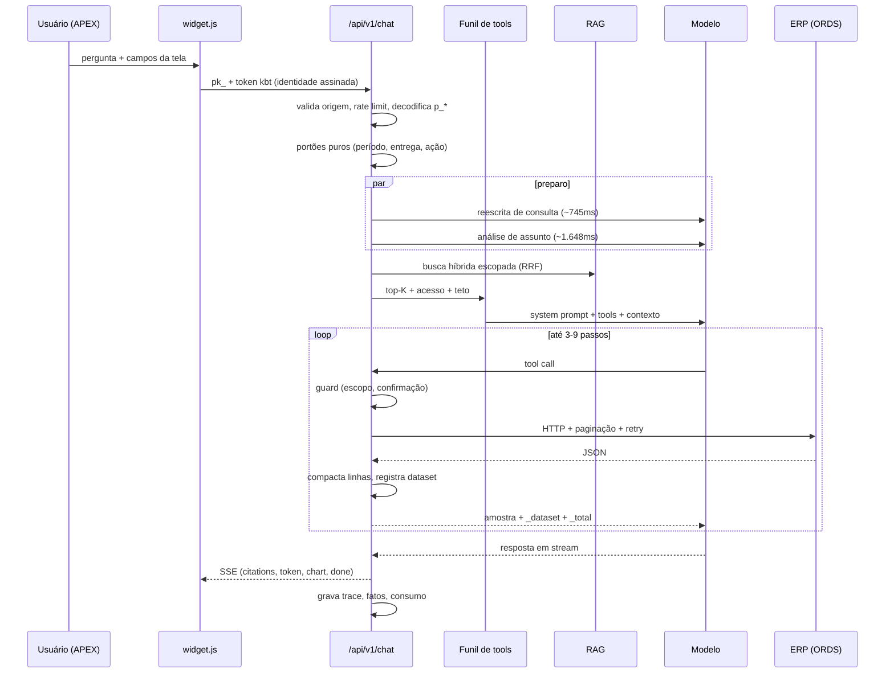

# Mapa do código

> Gerado pelo Cartographer em 2026-09-22, com 15 agentes lendo 1.403 arquivos
> (2,40M tokens). Ficaram de fora 220 arquivos (755k tokens) que não são o
> produto: skills de agente (`.claude/`, `.agents/`, `agent/skills`), dumps SQL
> de referência do ERP (`vscode-claude/`), o logo em base64, os relatórios de
> rodada em `eval/*.md` e o guia externo de 4.177 linhas.
>
> **Este mapa não substitui `docs/estado-e-proximos-passos.md`** — aquele diz o
> que está aberto HOJE; este diz onde as coisas moram e por que estão assim.

## O que este repositório é

Duas coisas num repositório só, e quem lê só metade toma decisão errada:

1. **Uma plataforma de base de conhecimento** (admin + portal público + widget
   embutível) — Next.js App Router, Supabase, editor de blocos próprio.
2. **Um chatbot de IA sobre o ERP Oracle APEX da Natcorp** — ~88 ferramentas de
   integração, RAG híbrido, multi-cliente com isolamento rígido por base.

O objetivo declarado do segundo é **assertividade acima de tudo**; velocidade e
custo vêm depois. Isso explica quase toda decisão estranha que você vai
encontrar.

### A característica mais incomum deste código

Os comentários registram **medições e hipóteses reprovadas**, com número e data:

> *"alargar o teto do top-K de 12 para 88 é inerte: 73/97 em todos os valores"*
> *"o gap mediano entre 1ª e 2ª ferramenta é 0,020, e em 46,9% dos turnos as duas estão a menos de 0,02"*
> *"cache 25%→30% e custo +5,6% — a chave fica no código, desligada, para a ideia não voltar sem o número junto"*

Trate cada `MAX_*`, `MIN_*` e limiar como resultado de experimento, não como
preferência. Vários "consertos óbvios" já foram tentados, medidos e revertidos —
e o comentário que explica isso costuma estar no arquivo que você ia mexer.

---

## Visão do sistema



**A regra de ouro do produto:** portal, widget e `/gestao` nunca têm rota, código
ou credencial que alcance o admin. A separação é por rota, por RLS e por chave —
não por checagem em componente.

---

## Estrutura de diretórios

```text
src/
  app/
    (admin)/admin/          431k tok — o console interno
      (auth)/               login → MFA obrigatório (AAL2) → definir senha
      (app)/                ~20 telas; padrão page.tsx + *-manager.tsx + actions.ts
        conteudo/           o editor + ~15 arquivos de server actions
        integracoes/        9 abas: bases, tools, agentes, fluxo, execuções…
        importar/           upload → extração → prévia → materializar
        ontologia/          glossário + dicionário de dados do APEX
        sistema/            IA, e-mail, backup, prompts (segredos = Owner)
        usuarios/           RBAC, convites, regra de não-escalada
    (portal)/docs/          portal público, leitura contínua por diretório
    gestao/                 área do cliente, servida em iframe no APEX
    api/
      v1/                   chave pk_ (widget) — SSE no chat
      manage/v1/            chave sk_ (server-to-server, escopos = RBAC)
      portal/ whatsapp/     superfícies públicas com rate limit
  lib/
    integrations/  219k     catálogo e roteamento das ~88 ferramentas
    chat/          219k     datasets, portões, fatos, anexos, prompt de tela
    ai/            106k     RAG, ontologia, cascata de prompt, config por finalidade
    blocks/         83k     motor de blocos JSON (substituiu o TipTap)
    importer/       81k     PDF/DOCX/PPTX/XLSX → árvore de artigos
    content/                árvore, overlays de cliente, chunking, publicação
    reports/                PDF/DOCX/XLSX/PPTX com a identidade Natcorp
    gestao/ portal/ widget/ tracking/ analyze/ apex/ backup/ ext/ whatsapp/
  components/
    editor/         100k    editor de blocos (canvas, painel de propriedades)
    ui/                     design system (42 primitivos)
    portal/ content/ admin/ gestao/
supabase/migrations/  149k  214 arquivos, idempotentes, sem ledger
scripts/              168k  os INSTRUMENTOS de medição (ver seção própria)
worker/                     pg-boss, ~25 filas, roda separado do web
apex/                       PL/SQL que o CLIENTE cola no APEX dele
oracle/                     pacotes PL/SQL de metadado e coleta de IR
.audit/                     scripts read-only contra o banco real
apps/extension/             extensão Chrome MV3 (interna, Fase 5)
docs/                       arquitetura, regras de negócio, estado corrente
eval/                       gabaritos (.jsonl) e relatórios de rodada
```

---

## Guia dos módulos

### `src/lib/integrations` — o funil das ferramentas

**A superfície mais medida do projeto.** Decide quais das ~88 ferramentas chegam
ao modelo em cada turno.

O caminho, em ordem, com o arquivo de cada etapa:

| # | Etapa | Arquivo | Teto/limiar |
|---|---|---|---|
| 1 | Contexto da base (cache) | `resolve.ts` | TTL 60s |
| 2 | Precisa de dados? Qual assunto? | `module-select.ts` | até 4 módulos |
| 3 | Quebra em facetas | `facets.ts` | `MAX_FACETAS=8` |
| 4 | Top-K semântico + resgate | `tool-catalog.ts`, `tool-narrow.ts` | `MIN_SEM=0.60`, `MIN_ANTIFLOOD=0.58` |
| 5 | Cobertura do catálogo | `cobertura.ts` | 6 candidatas, desc. 150 chars |
| 6 | Bônus por uso histórico | `aprendizado.ts` | `MAX_BONUS=0.06`, ≥3 amostras |
| 7 | Acesso (regras + taxonomia ERP) | `acesso-regras.ts` | negar vence, empate fecha |
| 8 | Teto final por faixa | `teto-tools.ts` | forçadas › deps › similaridade |
| 9 | Execução + retry + paginação | `executor.ts`, `retry-policy.ts` | retry só em GET/HEAD |
| 10 | Guards pré-chamada | `guards.ts` | 7 guards, falha fechada |

`MAX_TOOLS_MODELO = 6` (era 12) · `MAX_TOOLS_COMPOSTO = 18` · `TETO_DURO = 12` ·
`MAX_CHAMADAS_INTEGRACAO = 40`.

**Escopo por painel** (`panel-scope.ts`): PO=tudo, PG=equipe, PC=próprios,
PCAND=silêncio significa **bloqueado** (inverte o padrão dos outros).

### `src/lib/ai` — RAG, ontologia e prompt

Pipeline: reescrita de consulta (só quando a mensagem depende do turno anterior)
→ expansão por ontologia → embedding (cache 1h) → RPC `hybrid_search_scoped`
(léxico + vetor + boost, fusão **RRF k=60**) → vínculo termo→artigo → memória de
continuidade → desambiguação de tema → confiança (`LIMIAR_CONFIANCA = 0.022`).

**Composição do prompt** (`system-prompt.ts`): persona → especialização → uso das
ferramentas → linguagem → **regras por último** → CONTEXTO. As regras vão por
último para que texto do usuário não empurre a política para fora. `prompt-split.ts`
separa diretriz (fica no system) de dado (`dado_tela` antes do histórico,
`dado_pergunta` colado na última mensagem) — tudo a serviço do cache de prefixo.

**Config por finalidade** (`config.ts`): `chat`, `chat_ferramentas`,
`query_rewrite`, `report_analysis`, `embedding`, `import_*`, `editor_*`,
`transcricao`. Cascata: atribuição da base → atribuição de chat da base → global
→ env. Chave de IA **não** é variável de ambiente em produção: vive cifrada no
banco, configurada em Sistema→IA.

### `src/lib/chat` — o que o modelo lê

`datasets.ts` guarda as linhas **completas** por id; o modelo vê só
`{_dataset, _total, _colunas, amostra}`. Teto da amostra: **50 linhas e 60.000
caracteres**. As ferramentas de consulta (`query-tools.ts`) operam sobre 100% das
linhas, nunca sobre a amostra — é isso que dá contagem exata.

Portões **puros** (sem IO, para o eval reproduzir o que a rota faz):
`periodo.ts`, `entrega.ts`, `portao-acao.ts`, `escolha-numerada.ts`,
`referente-destacado.ts`, `procedencia.ts`.

### `src/lib/blocks` + `components/editor` — o editor

Um artigo é `BlockDoc = { version: 2, blocks: Block[] }` — árvore de objetos JSON,
não ProseMirror. 37 tipos de bloco. `normalizeDoc()` converte legado TipTap na
fronteira de leitura e é idempotente.

**Contrato WYSIWYG estrito:** o componente de edição de cada bloco deve espelhar
as classes do `render.tsx` do portal. Divergência é bug de produto — "o editor
não pode mentir sobre o que o leitor vai ver".

### `scripts/` — os instrumentos

Este projeto mede antes de mexer, e os instrumentos são código de primeira classe.

| Comando | Responde |
|---|---|
| `npm run eval:tools` | a ferramenta certa chega ao modelo? |
| `npx tsx --env-file=.env.local scripts/eval-rag.ts` | o documento certo entra nas vagas? |
| `npm run eval:cenarios-modelo` | o modelo decide certo com o turno inteiro? |
| `npm run eval:comparar` | **o que mudou entre duas rodadas**, caso a caso |
| `npm run perf:latencia` | onde o tempo vai (p50/p95, por dia, por passo) |
| `npm run rodada:e2e` | o que o cliente **paga** de fato, pela rota real |
| `npm run eval:plano` | o planner único diverge dos classificadores de hoje? |
| `.audit/sql.ts` | SELECT read-only no banco real |

Toda rodada grava em `ai_eval_runs`/`ai_eval_results` com `git_sha`, flags e o
**checksum do gabarito**; `eval:comparar` recusa comparar réguas diferentes.

---

## Fluxo de um turno de chat



**Números medidos deste caminho:** turno **sem** ferramenta 7,2s; **com**
ferramenta 23,2s. Latência geral p50 13,7s · p95 40,5s. O preparo custa p50
6.014ms (25% do turno) e são **três** idas ao modelo, não quatro — `facetas` é
embedding, não chamada de modelo.

---

## Convenções

- **Português em tudo** — funções, variáveis, comentários. Inglês só em termo
  técnico e em nome de tabela/coluna.
- **Result pattern**: server actions retornam `{ok:true,...} | {ok:false,error}`.
  Nunca `throw` para o cliente.
- **Puro × `server-only`**: regra de negócio testável fica em módulo puro
  (`pricing.ts`, `audit-article.ts`, `periodo.ts`, `teto-tools.ts`); o IO fica
  num módulo irmão. É o que permite o eval rodar exatamente o que a rota roda.
- **Permissão via `has_permission()`** — uma função SQL compartilhada entre RLS e
  backend. Nunca `if (role === 'admin')`. A UI esconde; o servidor recusa.
- **Paginação obrigatória** — `fetchAllPaged` ou `.range()` em qualquer leitura
  que possa crescer. Ver Gotcha nº 1.
- **Segredo em tabela isolada**, nunca em coluna revogada. Ver Gotcha nº 2.
- **Migration idempotente e re-rodável** — não há ledger.
- **Nunca degradar em silêncio** — corte, poda, troca de tipo de gráfico e campo
  vazio sempre geram aviso explícito (`_aviso`, `_vazios`, `avisos[]`).
- **Estados obrigatórios na UI**: carregando (esqueleto com a forma real), vazio
  (com ação), erro (com o que fazer), sucesso.

---

## Gotchas

As armadilhas abaixo já custaram tempo real. Estão ordenadas por quantas vezes
voltaram.

### 1. Teto de 1.000 linhas do PostgREST — mordeu pelo menos 6 vezes

O corte é **silencioso**: a consulta devolve 1.000 linhas e nenhum erro.

| Onde | Estrago medido |
|---|---|
| Ontologia | 1.014 de 5.569 termos chegavam à busca (82% ausente) |
| Traduções | exatamente 1.000 linhas para 4.424 termos, job dizia "100%" |
| Árvore de conteúdo | nós "subindo" para a raiz |
| Painel/análises | métricas congeladas em 1.000 sem aviso |
| Conversas | 1.745 mensagens, 1.000 devolvidas, 10 conversas apareciam vazias |
| Embeddings | tela dizia "16% indexado" com o espaço completo |

Solução consistente: agregar **no banco** (RPC) ou paginar com ordenação estável.
Existe regra de lint `select-sem-teto` para isso.

### 2. No Supabase, grant de tabela sobrepõe revoke de coluna

`revoke select (api_key_enc) ... from authenticated` **não funciona** — a coluna
segue legível. Repetiu-se 4 vezes. O padrão correto é tabela de segredo isolada,
sem grant nenhum, escrita só por função `SECURITY DEFINER`.

Irmão disso: `ALTER DEFAULT PRIVILEGES` do Supabase concede `EXECUTE` a `anon`
em toda função nova — `gc_versions()` era executável por visitante anônimo.
Revogar sempre de `public, anon, authenticated`, os três.

### 3. O eval mede o arreio, não o cavalo

`npm run eval:tools` roda `simTools` + `selecionarTopK` com teto próprio de **12**
— **não** o `buildIntegrationTools` de produção (`MAX_TOOLS_MODELO=6`, teto de
verdade, desempate, dependências). Quem mudar o funil confiando nesse placar mede
outra coisa.

Casos reais: baixar `MIN_SEM` de 0,60 para 0,50 "ganhava +4" no eval e **não
mudava nada** ponta a ponta; uma amostra `--n 99` de um conjunto de 130 escondia
justamente o caso que pegaria uma regressão aprovada.

### 4. Cache de prefixo: o bloco de ferramentas é a posição 0

Ele é remontado a cada pergunta e dá **11,8% de identidade** entre turnos, o que
invalida persona, regras e núcleo junto. A ideia de estabilizá-lo engordando o
bloco **foi reprovada duas vezes**: A/B real em 19/08 (cache 25%→30%, **custo
+5,6%**) e aritmética de 06/09 (conversa tem **p50 de 3 turnos**; break-even só
a partir de ~20). A chave `CHAT_LOCAIS_FIXAS` existe desligada para a ideia não
voltar sem o número.

### 5. Nulo não é zero

Em `ai_chat_traces.turn_id` e `ai_tool_casos`, nulo quer dizer "não sei" / "não
competiu". Somar imensurável ao denominador produz número que parece completo e
não é — por isso `casos_mediveis` é separado de `casos_total`. Idem em
`custo-da-rodada.ts`: modelo sem preço cadastrado **aborta**, em vez de contar
zero e deixar o teto de gasto cego.

### 6. Regex e acento

`\b` é ASCII em JavaScript. Normalizar (tirar acento) **antes** de casar — bug
repetido e corrigido em `periodo.ts`, `entrega.ts`, `portao-acao.ts` e
`datasets.ts`.

### 7. Chave por painel × chave por base

A chave do widget é **uma por painel**, compartilhada por todos os clientes, em
texto puro dentro do APEX de cada um. Numa tela que mostra consumo e conversas
isso permitiria emitir token dizendo ser outro cliente. Por isso `/gestao` usa
chave **por base** (`ai_base_tracking_keys`), com validação invertida: lê o
`p_base` não confiado → busca a chave daquela base → só então confere o HMAC.
`.audit/gestao-isolamento-e2e.ts` prova isso contra o banco real.

### 8. Armadilhas do ERP Oracle

- `REQUISICAO_FERIAS` não tem `filial` nem `dias_direito`; `sit_requisicao` é
  `VARCHAR2(1)` com `'1'`/`'2'`/`'4'`.
- Parcelas de férias são despachadas por campo `n`, **nunca por posição** do
  array — o motor remove posições vazias.
- O legado de férias **commita por dentro**: não há transação para desfazer. Por
  isso `aprovar` responde pelo estado observado, nunca pelo `pflg_retorno`.
- Recusa de negócio é **HTTP 200 com `ok:false`** de propósito; 4xx faria o
  modelo tratar como falha e mudar de assunto.
- Apuração de ponto só existe para competência **fechada** — `eventos: []` no mês
  corrente é regra, não defeito.

### 9. `.audit/*.mjs` não rodam mais

Montam `pg.Client` com `connectionString`, e a senha do banco tem `@`/`#` —
`new URL` quebra. Use `parseDbConfig()`, como `.audit/sql.ts`.

### 10. Onde a CI protege e onde não

`ci.yml` roda em PR e push: typecheck, lint, dívida de UI, testes, build, e2e.
**Não roda eval** — por decisão explícita: o eval precisa do banco real e gasta
embedding, e a pergunta dele é "para onde o número está indo", não "este commit
quebrou". A série vive em `eval.yml`, **agendada**.

Consequência prática: um PR pode mudar descrição de ferramenta ou prompt sem
nenhuma prova de que não piorou a assertividade. O job `superficie-medida` avisa
o que foi tocado, mas **só roda em `pull_request`** e sua lista de superfícies
não cobre `src/lib/chat/datasets.ts`.

---

## Pendências conhecidas (verificar em `docs/estado-e-proximos-passos.md`)

| Item | Estado |
|---|---|
| `.env` de produção versionado em repositório **público** | aberto, adiado pelo dono |
| PII real em `.audit/blocos/*.txt` (1 CPF, 3 e-mails) | achado em 21/09, aguarda decisão |
| Gabarito de INTENÇÃO (destrava o planner único) | rotulação é do dono |
| `MAX_ITENS_MODELO` (50) — subir agora que a linha encolheu 48% | decisão do dono |
| Reindexação de fragmentos (815 → 261 previsto) | medido, não aplicado |
| Chat não pode dizer nome de tabela/campo fora de "Carga de Dados" | mapa de vazamento pronto, 7 itens |

---

## Guia de navegação

**Adicionar uma ferramenta de integração** → cadastre em `/admin/integracoes`
(aba APIs/Tools). Código só se precisar de guard novo: `guards.ts` +
`guard-catalog.ts`. Depois **meça**: `npm run eval:tools`. Lembre que
`invalidateBaseContext()` tem 60s de defasagem.

**Mudar o funil de seleção** → `tool-narrow.ts` (corte), `teto-tools.ts` (teto),
`module-select.ts` (assunto). Meça antes e depois, e saiba que `eval:tools` não
enxerga `buildIntegrationTools` (Gotcha 3).

**Mexer no RAG** → `src/lib/ai/rag.ts` e a RPC `hybrid_search_scoped`. Meça com
`scripts/eval-rag.ts`. O gabarito tem 42 casos — abaixo de 30 ele acha defeito
mas não conclui melhora.

**Adicionar um tipo de bloco** → `lib/blocks/schema.ts` (tipo) +
`registry.meta.ts` (metadado) + `components/editor/blocks/blocks/*` (edição) +
`lib/blocks/render.tsx` (leitura). Os quatro, ou o build quebra — e se render e
edição divergirem, o editor mente.

**Adicionar uma tela de admin** → `page.tsx` (server, checa permissão) +
`*-manager.tsx` (client) + `actions.ts` (server actions com `requirePermission`
e `audit`) + `loading.tsx` + `error.tsx`. Registre a rota em
`lib/admin/mapa-rotas.ts` — é a fonte única para abas, breadcrumb e Cmd+K.

**Mudar permissão** → migration alterando `permissions`/`role_permissions`.
Nunca `if` em componente. Se o escopo for por subárvore, use
`has_permission_node` (e cuidado com o self-join em `INSERT ... RETURNING` —
Gotcha em `has_permission_node_row`).

**Alterar o schema** → sempre migration em `supabase/migrations/`, idempotente.
Aplique com `npm run migrate:apply -- <arquivo>`.

**Investigar "o agente escolheu a ferramenta errada"** → `/admin/logs` (trace
passo a passo) e `ai_tool_runs` (requisição/resposta/duração). O passo
`integracoes:ranking` mostra a nota de cada ferramenta, **inclusive as cortadas**
— é isso que distingue "a certa ficou em 2º" (desempate) de "ficou em 40º"
(embedding/ontologia).

**Investigar custo** → `/admin/faturamento` e a tabela `ai_usage`, que separa
`cache_read_tokens` de `cache_write_tokens`. Somar tudo superestima em ~45%.
