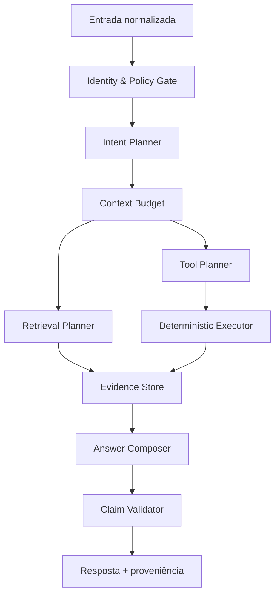

# Plano mestre de engenharia de IA — Agente Natcorp

**Objetivo:** maximizar precisão, assertividade e qualidade das respostas, reduzindo simultaneamente tokens, latência e custo operacional.  
**Repositório de referência:** `igorsala7/natcorp-base-conhecimento`  
**Baseline inspecionado:** branch `main`, commit `af6a1563db317f6be2ca93faeeffa8143469e715`  
**Público-alvo deste documento:** agente/engenheiro responsável pela implementação.  
**Regra de execução:** nenhuma mudança estrutural deve ser aplicada sem testes, feature flag, telemetria e comparação com o baseline.

---

## 1. Resultado esperado

O sistema não deve tentar tornar um único LLM capaz de compreender, simultaneamente, cerca de 100 ferramentas, múltiplas fontes RAG, ontologia, histórico, contexto de tela, perfis e regras de negócio. A arquitetura deve reduzir o problema antes de apresentá-lo ao modelo.

O fluxo-alvo é:

1. identificar deterministicamente usuário, perfil, painel e permissões;
2. entender a intenção uma única vez;
3. construir um plano estruturado;
4. recuperar somente as fontes e ferramentas necessárias;
5. executar ações e consultas por código sempre que possível;
6. converter os resultados em fatos rastreáveis;
7. permitir ao modelo apenas interpretar e redigir sobre esses fatos;
8. validar a resposta antes de entregá-la.

### 1.1 Metas iniciais

| Indicador | Meta |
|---|---:|
| Tool correta no top-1 | ≥ 92% |
| Tool correta no top-3 | ≥ 98% |
| Perguntas simples com mais de 5 tools expostas | < 5% |
| Chamadas ORDS em consulta simples | p95 ≤ 2 |
| Chamadas de IA antes da geração final | p95 ≤ 1 |
| Tokens novos de entrada em turno simples | p95 ≤ 6.000 |
| Tokens de saída em turno simples | p95 ≤ 1.200 |
| Claims factuais sem proveniência | 0% no eval crítico |
| Consulta com período/identificador inventado | 0 |
| Respostas incorretamente declaradas completas | 0 |
| Latência até primeiro token, turno simples | p95 ≤ 4 s |
| Regressão permitida no eval principal | ≤ 1 ponto percentual, com justificativa |

As metas devem ser recalibradas após duas semanas de produção, mas nunca sem preservar os invariantes de segurança e proveniência.

---

## 2. Diagnóstico da arquitetura atual

### 2.1 Pontos fortes que devem ser preservados

- isolamento por `space_id`, chave, base, painel, empresa, perfil e identidade;
- procedência de matrículas e identificadores baseada em dados reais;
- confirmação para operações de escrita;
- separação entre credenciais de serviço e credenciais pessoais;
- busca híbrida com escopo e herança de conteúdo;
- ontologia com aliases e suporte multilíngue;
- paginação ORDS e indicação de truncamento;
- datasets persistidos e ferramentas de análise sobre o conjunto completo;
- deduplicação de GETs por turno;
- cache de prompt e rastreamento de tokens de leitura/escrita;
- traces de roteamento, ranking, ferramentas e custo;
- evals de tools e RAG já existentes.

### 2.2 Problema estrutural

`src/app/api/v1/chat/route.ts` concentra mais de 3.400 linhas e combina autenticação, resolução de contexto, reescrita, RAG, ontologia, roteamento, agentes, execução, geração, arquivos, streaming e persistência. O comportamento emerge da interação de muitas flags e heurísticas.

O pipeline atual pode fazer, antes da resposta principal:

- reescrita de consulta;
- decomposição em facetas;
- um ou vários embeddings;
- classificação de módulo;
- classificação de cobertura;
- ranking de tools;
- desambiguação;
- montagem de prompt;
- loop de até nove passos;
- fallback adicional para fechamento ou arquivo.

Cada camada foi criada para corrigir casos reais, mas o conjunto produz três efeitos:

1. **decisões contraditórias:** uma etapa pode apagar ou desfazer a intenção identificada pela anterior;
2. **fallback caro:** falhas tendem a preservar recall carregando muitas ferramentas;
3. **baixa demonstrabilidade:** fica difícil provar que nenhum caminho executa uma API com parâmetros inventados.

---

## 3. Princípios obrigatórios da arquitetura-alvo

### 3.1 Menor privilégio cognitivo

O modelo deve receber somente os dados, ferramentas e instruções indispensáveis ao turno. Menor privilégio não vale apenas para autorização; vale também para contexto.

### 3.2 Código decide invariantes; LLM decide linguagem

Devem ser determinísticos:

- autorização;
- escopo;
- campos obrigatórios;
- confirmação;
- procedência;
- dependências entre ferramentas;
- limites de custo;
- completude do conjunto;
- validação de claims factuais.

O LLM pode decidir:

- intenção quando não for resolvível por regras;
- interpretação qualitativa;
- ordem de apresentação;
- redação adequada ao perfil;
- necessidade de explicar ou resumir.

### 3.3 Falha segura e barata

Falha de classificador, embedding ou cache não pode significar “expor todas as tools”. O fallback deve ser top-3 conservador, regra lexical ou pergunta de desambiguação.

### 3.4 Uma verdade por turno

O sistema deve produzir um único `TurnPlan` canônico. RAG, tools, agentes, orçamento e resposta devem consumir esse plano, sem reconstruir a intenção em paralelo.

### 3.5 Todo fato tem procedência

Número, data, nome, matrícula, situação e regra de negócio devem apontar para uma origem verificável: tool call, dataset, tela, arquivo ou trecho RAG.

### 3.6 Otimização orientada a eval

Nenhum limiar, teto ou reranker deve mudar sem comparação reproduzível. Comentários com casos reais são úteis, mas não substituem uma catraca automatizada.

---

## 4. Arquitetura-alvo



### 4.1 Estados do turno

```ts
type TurnOutcome =
  | { kind: "continue"; state: TurnState }
  | { kind: "clarify"; question: Clarification }
  | { kind: "deny"; reason: PolicyReason }
  | { kind: "fail"; publicMessage: string; diagnosticId: string };
```

Cada fase deve retornar uma união discriminada. Não usar combinação de dezenas de booleanos para representar estados incompatíveis.

### 4.2 Estrutura de diretórios proposta

```text
src/lib/agent/
  contracts/
    intent-plan.ts
    tool-contract.ts
    evidence.ts
    answer-plan.ts
    turn-state.ts
  pipeline/
    authenticate.ts
    normalize.ts
    plan-intent.ts
    allocate-budget.ts
    retrieve.ts
    plan-tools.ts
    execute-tools.ts
    compose-answer.ts
    validate-answer.ts
    persist-turn.ts
  routing/
    deterministic-router.ts
    semantic-router.ts
    tool-graph.ts
    confidence.ts
  evidence/
    store.ts
    claims.ts
    provenance.ts
  budgets/
    context-budget.ts
    execution-budget.ts
  eval/
    fixtures.ts
    metrics.ts
```

`src/app/api/v1/chat/route.ts` deve tornar-se um adaptador HTTP/SSE, sem regras de negócio profundas.

---

## 5. Épico A — segurança e invariantes críticos

### A1. Remover e rotacionar segredos publicados

**Prioridade:** bloqueante, antes das melhorias de IA.

O repositório público contém `.env` de produção versionado. O agente implementador deve preparar um plano separado de incidente e aguardar autorização antes de executar operações destrutivas.

Entregas:

- inventário de todas as credenciais no `.env` e histórico, sem reproduzir valores em logs;
- matriz serviço → segredo → impacto → responsável → status de rotação;
- rotação de Supabase service role, banco/pooler, Upstash, cookies, chave de criptografia e provedores;
- estratégia específica para recriptografar segredos quando `APP_ENCRYPTION_KEY` mudar;
- remoção do `.env` do índice;
- limpeza de histórico;
- secret scanning e push protection;
- `.env.example` apenas com nomes e valores fictícios;
- teste automatizado com Gitleaks/TruffleHog na CI.

Critério de aceite: nenhuma credencial antiga continua válida e nenhum scanner encontra segredo verificável no HEAD ou no histórico reescrito.

### A2. Período ausente deve interromper o plano

Arquivo atual: `src/lib/integrations/tool-builder.ts`, bloco próximo de `periodoInformado` e `jaBarrouPeriodo`.

Criar:

```ts
type MissingRequirement = {
  kind: "missing_requirement";
  requirement: "period" | "identity" | "confirmation" | "subject";
  requiredBy: string[];
  options?: Array<{ id: string; label: string; value: unknown }>;
};
```

Comportamento:

1. `ToolPlanner` detecta requisitos antes de expor a tool ao modelo;
2. se falta período, retorna `clarify`;
3. zero chamada ORDS ocorre;
4. a escolha confirmada é persistida como fato da conversa;
5. o turno seguinte reutiliza exatamente o valor confirmado;
6. o modelo não pode preencher o requisito por inferência.

Testes:

- pergunta sem período para uma tool;
- duas tools exigindo período no mesmo turno;
- período no histórico, mas não confirmado;
- período confirmado via `scope.periodo`;
- período parcial;
- data futura e período aquisitivo passado;
- assert de zero chamadas HTTP antes da confirmação.

### A3. Procedência ampliada

Preservar o guard atual de identificadores e estendê-lo para:

- datas;
- valores monetários;
- percentuais;
- códigos de empresa/filial/centro de custo;
- e-mails de destinatários;
- IDs de eventos/arquivos.

Criar um `FactLedger` por turno/conversa:

```ts
type TrustedFact = {
  factId: string;
  type: "person_id" | "date" | "money" | "org_id" | "email" | "record_id";
  value: string;
  source: EvidenceRef;
  scope: { base: string; userRef: string; conversationId: string };
  expiresAt?: string;
};
```

Parâmetro sensível só pode ser executado se derivar de `TrustedFact`, identidade autenticada ou entrada literal confirmada do usuário.

---

## 6. Épico B — plano único de intenção

### B1. Contrato `IntentPlan`

```ts
const IntentPlanSchema = z.object({
  version: z.literal(1),
  intent: z.enum([
    "social", "self", "documentation", "lookup", "analysis",
    "write_action", "screen_action", "export", "mixed"
  ]),
  subjects: z.array(z.object({
    entity: z.string(),
    value: z.string().nullable(),
    provenance: z.enum(["message", "history", "screen", "identity", "unknown"])
  })).max(12),
  facets: z.array(z.string()).max(8),
  modules: z.array(z.string()).max(6),
  needs: z.object({ rag: z.boolean(), tools: z.boolean(), screen: z.boolean() }),
  requestedOutput: z.enum(["answer", "list", "analysis", "chart", "file", "action"]),
  requirements: z.array(z.object({
    key: z.string(),
    status: z.enum(["present", "missing", "needs_confirmation"])
  })),
  complexity: z.enum(["simple", "compound"]),
  confidence: z.number().min(0).max(1)
});
```

### B2. Estratégia híbrida

Ordem:

1. regras determinísticas de alta precisão;
2. resolução de escolhas/continuações com estado persistido;
3. classificador pequeno somente para o restante;
4. validação Zod e vocabulário;
5. fallback conservador.

Regras determinísticas recomendadas:

- social e perguntas sobre o próprio agente;
- confirmações sim/não com pendência ativa;
- seleção numerada;
- pedidos explícitos de arquivo/gráfico;
- ação de tela com campos conhecidos;
- tool explicitamente escolhida pelo usuário;
- modo de fonte exclusiva;
- pergunta documental marcada pela UI;
- continuação vinculada a um plano pendente.

### B3. Eliminar classificadores redundantes

O `IntentPlan` deve substituir gradualmente:

- decisões duplicadas de `interpretarConsulta`;
- `analisarPedido` como chamada independente;
- decomposição tardia de facetas;
- classificador separado de cobertura, quando o plano já tiver confiança baixa;
- regexes dispersas de pergunta composta.

Não remover tudo de uma vez. Primeiro execute o novo planner em shadow mode e compare sua saída com o pipeline atual.

### B4. Fallback correto

```ts
if (plan.confidence < 0.55) {
  return clarify(buildIntentClarification(plan));
}
```

Se a chamada de planejamento falhar:

- usar regras lexicais e histórico estruturado;
- limitar candidatas a três;
- não expor o catálogo inteiro;
- registrar `planner_fallback`.

---

## 7. Épico C — catálogo e roteamento de tools

### C1. Contrato estruturado de tool

Adicionar ao banco, preferencialmente de forma aditiva:

```sql
create table ai_tool_contracts (
  tool_id uuid primary key references ai_tools(id) on delete cascade,
  contract_version integer not null default 1,
  intent text not null,
  entities text[] not null default '{}',
  read_only boolean not null,
  risk_level text not null check (risk_level in ('low','medium','high')),
  requires jsonb not null default '[]',
  output_schema jsonb,
  allowed_output_fields text[],
  estimated_latency_ms integer,
  estimated_tokens integer,
  updated_at timestamptz not null default now()
);

create table ai_tool_dependencies (
  tool_id uuid not null references ai_tools(id) on delete cascade,
  depends_on_tool_id uuid not null references ai_tools(id) on delete cascade,
  condition jsonb,
  priority integer not null default 0,
  primary key (tool_id, depends_on_tool_id),
  check (tool_id <> depends_on_tool_id)
);
```

### C2. Remover dependências de descrições

Hoje `dependenciasCitadas` procura chaves dentro do texto da descrição. Migrar para `ai_tool_dependencies`.

Implementar:

- validador de ciclos;
- ordenação topológica;
- dependência condicional por requisito;
- teste de cobertura: toda dependência está ativa, habilitada e acessível;
- painel administrativo que mostre o grafo;
- compatibilidade temporária: texto livre apenas como fallback instrumentado.

### C3. Pipeline de seleção

Ordem obrigatória:

1. autorização por base/perfil/painel;
2. compatibilidade com público e agente;
3. intenção e módulo do `IntentPlan`;
4. ranking semântico/lexical;
5. regras de desempate;
6. dependências explícitas;
7. orçamento de tools;
8. verificação de cobertura.

Nunca ranquear antes da autorização e nunca permitir que ranking reintroduza uma tool bloqueada.

### C4. Limites por confiança

```ts
function toolBudget(confidence: number, complexity: "simple" | "compound") {
  if (complexity === "compound") return confidence >= 0.75 ? 8 : 5;
  if (confidence >= 0.85) return 3;
  if (confidence >= 0.65) return 5;
  return 0;
}
```

Confiança baixa retorna clarificação. Não deve retornar 12 ou 18 tools.

### C5. Reranker

O ranking deve combinar:

```text
score =
  0,40 × similaridade_semântica
+ 0,20 × match_intent
+ 0,15 × match_entidade
+ 0,10 × match_lexical_exato
+ 0,10 × sucesso_histórico_calibrado
+ 0,05 × disponibilidade/saúde
- penalidade_ambiguidade
- penalidade_custo
```

Pesos são ponto de partida. Treinar/calibrar com casos rotulados. Aprendizado de uso nunca deve usar apenas “a tool foi chamada”; deve usar feedback de sucesso ou resolução confirmada, evitando reforçar erros do modelo.

### C6. Schemas mínimos para o modelo

O modelo não deve ver parâmetros preenchidos pelo servidor, headers, credenciais, escopo ou detalhes ORDS. Para cada tool, enviar:

- nome curto;
- quando usar;
- quando não usar;
- parâmetros que o usuário/modelo realmente precisa informar;
- formato resumido de retorno;
- efeitos colaterais.

Meta: reduzir em pelo menos 50% os tokens do bloco de tools em perguntas simples.

---

## 8. Épico D — execução determinística

### D1. Planner versus executor

O LLM escolhe operações lógicas; o servidor executa o plano.

```ts
type ToolExecutionPlan = {
  operations: Array<{
    id: string;
    toolKey: string;
    args: Record<string, unknown>;
    dependsOn: string[];
    purpose: string;
  }>;
  stopWhen: Array<"answerable" | "missing_requirement" | "policy_denied">;
};
```

O servidor deve:

- validar o plano;
- aplicar dependências;
- executar leituras independentes em paralelo;
- serializar escritas;
- interromper ao obter evidência suficiente;
- evitar que o LLM reemita chamadas equivalentes.

### D2. Orçamento de execução

```ts
type ExecutionBudget = {
  maxToolCalls: number;
  maxOrdRequests: number;
  maxWallMs: number;
  maxResultBytes: number;
  maxRetries: number;
};
```

Valores iniciais:

| Classe | Tool calls | ORDS | Tempo | Retries |
|---|---:|---:|---:|---:|
| lookup simples | 2 | 3 | 15 s | 1 |
| lista | 3 | 8 | 30 s | 1 |
| análise | 5 | 15 | 60 s | 1 |
| composto | 6 | 20 | 90 s | 1 |
| escrita | 2 | 3 | 30 s | 0 após efeito incerto |

O teto atual de 40 chamadas deve permanecer apenas como proteção extrema durante a migração e depois ser removido.

### D3. Idempotência e escrita

Para POST/PUT/PATCH/DELETE:

- exigir `confirmation_id` vinculado ao hash de tool + args;
- incluir chave de idempotência quando a API suportar;
- não repetir após timeout sem verificar estado;
- persistir estado `planned`, `confirmed`, `sent`, `succeeded`, `unknown`, `failed`;
- resposta nunca deve dizer “feito” se o estado for `unknown`.

### D4. Contratos de saída e minimização

Cada tool deve ter `output_schema` e `allowed_output_fields`. Remover `select *` sempre que possível no ORDS.

Antes do LLM:

1. validar formato;
2. redigir `secret` e PII não necessária;
3. normalizar nomes de campos;
4. persistir conjunto completo como dataset;
5. enviar ao modelo apenas amostra/resumo + `dataset_id`;
6. usar ferramentas determinísticas para agregações.

Substituir a sanitização por blacklist como defesa principal. O limite de profundidade atual não deve devolver subobjetos crus.

---

## 9. Épico E — RAG e ontologia

### E1. Recuperação em estágios

Pipeline:

1. filtro de escopo/autorização;
2. busca lexical + vetorial;
3. expansão ontológica controlada;
4. deduplicação;
5. agrupamento por manual/documento;
6. reranking;
7. seleção por orçamento;
8. validação de cobertura.

### E2. Ontologia não é prova

Adicionar ao vínculo termo→nó:

```sql
alter table ontology_terms
  add column link_confidence numeric,
  add column link_status text default 'draft',
  add column link_source text,
  add column reviewed_at timestamptz,
  add column reviewed_by uuid;
```

Regras:

- vínculo aprovado gera boost forte;
- vínculo automático/draft gera boost fraco;
- nunca ignorar o score de conteúdo apenas porque `forced=true`;
- termo genérico exige match adicional de contexto;
- registrar quando a ontologia mudou o top-1.

### E3. Confidence calibrada

O limiar fixo de RRF deve ser substituído por score composto e calibrado por tipo de consulta.

Sinais:

- score lexical;
- score vetorial;
- reranker;
- concordância entre sinais;
- distância top-1/top-2;
- cobertura de termos/entidades;
- vínculo ontológico revisado;
- continuidade do tema;
- tipo de fonte.

Saída:

```ts
type RetrievalConfidence = {
  value: number;
  band: "high" | "medium" | "low";
  reasons: string[];
};
```

### E4. Chunking

Reavaliar chunks por tipo de documento:

- procedimento: preservar passos e pré-condições;
- tabela: preservar header + linhas coerentes;
- política: preservar vigência, exceções e responsáveis;
- FAQ: pergunta e resposta juntas;
- relatório importado: converter em dataset, não em texto narrativo;
- documento longo: estrutura hierárquica e parent context.

Adicionar metadados: `document_version`, `valid_from`, `valid_to`, `heading_path`, `manual`, `content_type`, `authority`, `language`.

### E5. Enumeração sem despejar 40 chunks

Quando o usuário pede “todos”:

- preferir consulta estruturada ao dataset;
- agregar no servidor;
- retornar contagem, itens e sinal de completude;
- se a fonte é documento textual, extrair lista na ingestão e indexar como estrutura;
- usar paginação na resposta, não inserir todo o corpus no prompt.

### E6. Frescor e versões

Toda resposta de política/documentação deve conseguir informar a versão da fonte. Conteúdo substituído não deve competir com versão vigente, salvo consulta histórica explícita.

---

## 10. Épico F — Evidence Store e validação de resposta

### F1. Modelo de evidência

```ts
type EvidenceRef =
  | { kind: "rag"; sourceId: string; chunkId: string; version: string }
  | { kind: "tool"; runId: string; toolKey: string; datasetId?: string }
  | { kind: "screen"; captureId: string; field: string }
  | { kind: "attachment"; attachmentId: string; locator?: string }
  | { kind: "user"; messageId: string };

type EvidenceFact = {
  id: string;
  predicate: string;
  subject?: string;
  value: unknown;
  unit?: string;
  evidence: EvidenceRef[];
  complete: boolean;
};
```

### F2. AnswerPlan

Antes de produzir linguagem livre:

```ts
type AnswerPlan = {
  directAnswer: Array<{ claim: string; evidenceIds: string[] }>;
  analysis: Array<{ observation: string; basedOn: string[] }>;
  limitations: string[];
  followUp?: string;
};
```

### F3. Validador

Validações determinísticas:

- números e datas da seção factual existem nas evidências;
- citações apontam para fonte real;
- tool/dataset citado pertence ao turno/conversa/usuário;
- resultado truncado não gera afirmação completa;
- filtros e período apresentados correspondem aos args executados;
- nome e identificador pertencem ao mesmo registro;
- escrita só é confirmada com resultado `succeeded`.

Validações semânticas opcionais, por modelo pequeno:

- claim é sustentado pelo trecho;
- interpretação não contradiz fato;
- resposta atende a todas as facetas.

O verificador semântico deve receber apenas claims e evidências relevantes, não o prompt inteiro.

### F4. Política de falha

Se um claim falhar:

- removê-lo ou regenerar somente o trecho afetado;
- nunca regenerar o turno inteiro automaticamente mais de uma vez;
- registrar `claim_validation_failed`;
- informar limitação se a evidência for insuficiente.

---

## 11. Épico G — prompts e agentes

### G1. Prompt em camadas estáveis

Separar:

1. política global imutável;
2. política do tenant/perfil;
3. especialização do agente;
4. plano do turno;
5. evidências;
6. formato da resposta.

Somente 4–6 devem variar a cada turno. Isso melhora cache de prefixo.

### G2. Matriz de proveniência

Definir comportamento por claim:

| Classe | Fonte permitida |
|---|---|
| Produto Natcorp | documentação/tela/tool |
| Dado pessoal/empresa | tool, dataset ou tela autorizada |
| Regra interna | documento vigente identificado |
| Legislação vigente | fonte oficial/versionada |
| Conceito geral de RH | conhecimento do modelo, rotulado como explicação |
| Análise | inferência explícita sobre fatos citados |

Remover ambiguidades entre “responda apenas pelo contexto” e “use conhecimento amplo de RH”.

### G3. Seleção de agente

Escolher agente após o toolset final:

```text
agent_score =
  0,45 × cobertura_tools_selecionadas
+ 0,25 × aderência_módulos
+ 0,20 × aderência_intenção
+ 0,10 × prioridade_configurada
```

Requisitos:

- agente inelegível nunca entra;
- prioridade não vence aderência;
- pedido composto pode usar várias especializações, mas uma única política global;
- prompts de agentes não devem repetir regras absolutas;
- trace deve guardar candidatos e scores.

### G4. Prompts compactos

Trocar parágrafos longos por contratos operacionais curtos. Exemplo:

```text
Use apenas EvidenceFacts para fatos.
Separe fato de análise.
Não declare completude quando complete=false.
Mostre filtros e período usados.
Se faltar evidência, diga o que falta.
```

Regras executadas por código devem sair do prompt.

---

## 12. Épico H — orçamento de contexto e tokens

### H1. `ContextBudget`

```ts
type ContextBudget = {
  modelContext: number;
  reservedOutput: number;
  system: number;
  tools: number;
  history: number;
  rag: number;
  evidence: number;
  safetyMargin: number;
};
```

Usar tokenizer real ou estimador específico por provedor. Não usar apenas caracteres/4 para decisões críticas.

### H2. Perfil de orçamento por turno

| Tipo | System | Tools | Histórico | RAG/evidência | Saída |
|---|---:|---:|---:|---:|---:|
| social/self | mínimo | 0 | 1 turno | 0 | 300 |
| documentação | compacto | 0 | resumo + 4 msgs | 4–8k | 1.500 |
| lookup | compacto | ≤ 5 tools | fatos + 4 msgs | ≤ 6k | 1.200 |
| análise | compacto | ≤ 8 tools | resumo + fatos | ≤ 15k | 4.096 |
| ação | política + confirmação | ≤ 3 tools | pendência | mínimo | 1.000 |

### H3. Memória

Separar:

- mensagens recentes;
- fatos confirmados;
- decisões/pendências;
- datasets;
- resumo semântico da conversa.

Não reenviar 24 mil caracteres por padrão. O planner escolhe quais fatos e mensagens são necessários.

### H4. Resultados de tools

O modelo recebe:

```json
{
  "dataset_id": "ds7",
  "total": 965,
  "complete": true,
  "filters": { "period": "2026-08" },
  "columns": ["filial", "quantidade"],
  "summary": { "count": 965 },
  "sample": []
}
```

Agregações e filtros são feitos por ferramentas sobre o dataset; linhas completas não circulam no loop.

### H5. Saída dinâmica

- lookup: 768–1.200 tokens;
- explicação documental: 1.500–2.000;
- análise: 3.000–4.096;
- arquivo: o conteúdo principal vai ao artefato, chat recebe confirmação curta.

Não usar 8.192 sempre que houver tool.

---

## 13. Épico I — cache e performance

### I1. Cache em dois níveis

- L1: memória por processo, TTL curto;
- L2: Redis/KV compartilhado, versionado.

Chaves:

```text
ontology:{space_id}:{ontology_version}:{lang}
tool_catalog:{base_id}:{catalog_version}:{profile}:{panel}
intent:{normalized_question_hash}:{context_signature}
embedding:{model}:{dimension}:{text_hash}
rag:{space_versions}:{query_hash}:{scope}
```

### I2. Invalidação por versão

Incrementar versão ao:

- publicar/alterar conteúdo;
- alterar ontologia;
- alterar tool/contrato;
- alterar vínculo de agente;
- alterar permissão/perfil.

TTL passa a ser segurança secundária, não mecanismo principal.

### I3. Paralelização

Pode ser paralelo:

- busca lexical e vetorial;
- leituras de contexto independentes;
- tools GET sem dependência;
- carregamento de metadados e memória.

Deve ser serial:

- operações com dependência;
- escritas;
- confirmação;
- ações cujo resultado altera o próximo passo.

### I4. Timeouts

Cada fase deve ter budget próprio, subordinado ao prazo do turno. Ao estourar:

- embedding → fallback lexical top-3;
- RAG → resposta limitada, sem fingir completude;
- tool → estado de erro verificável;
- planner → clarificação;
- composer → mensagem segura baseada nos fatos já disponíveis.

---

## 14. Épico J — observabilidade e avaliação

### J1. Evento canônico do turno

Registrar:

```ts
type TurnTelemetry = {
  turnId: string;
  plan: { intent: string; confidence: number; facets: number };
  retrieval: { candidates: number; selected: number; confidence: number };
  tools: { eligible: number; exposed: number; called: string[]; correct?: boolean };
  execution: { ordRequests: number; retries: number; wallMs: number };
  answer: { claims: number; validated: number; rejected: number };
  tokens: { planner: number; tools: number; rag: number; history: number; output: number; cacheRead: number };
  outcome: string;
};
```

### J2. Métricas de roteamento

- top-1 accuracy;
- Recall@3 e Recall@5;
- MRR;
- taxa de tool irrelevante exposta;
- taxa de tool incorreta chamada;
- taxa de clarificação útil;
- taxa de fallback por falha técnica;
- tools por turno por percentil e perfil.

### J3. Métricas RAG

- Recall@K por pergunta;
- nDCG/MRR;
- precisão do top-1;
- precisão do vínculo ontológico;
- groundedness/entailment;
- cobertura de todas as facetas;
- documento vigente versus obsoleto;
- chunks e tokens por resposta.

### J4. Métricas de resposta

- factual consistency;
- citation precision/recall;
- completude;
- resposta direta;
- separação fato/análise;
- ação confirmada corretamente;
- satisfação/feedback;
- recontato corretivo em até três turnos.

### J5. Conjuntos de avaliação

Manter conjuntos separados:

1. perguntas documentais;
2. lookup simples;
3. tools irmãs/ambíguas;
4. pedidos compostos;
5. continuação e anáfora;
6. perfil/painel/permissão;
7. períodos e datas;
8. identificadores e procedência;
9. resultados vazios/truncados;
10. ações de escrita;
11. prompt injection em documentos/tools;
12. multilingual;
13. custo/latência.

Cada caso deve trazer entrada, estado, tools permitidas, tool esperada, argumentos esperados, fontes esperadas e invariantes.

### J6. CI/CD

Em todo PR:

- typecheck, lint sem aumento de warnings, unitários;
- eval offline de roteamento/gates;
- orçamento estático de tokens dos schemas/prompts;
- detecção de segredos;
- teste de migrações;
- teste de ciclos de dependências.

Quando arquivos críticos mudarem:

- eval conectado obrigatório;
- comparação com baseline do mesmo checksum;
- falha se precisão cair além da margem ou custo subir sem justificativa.

O eval agendado não pode ser pulado silenciosamente. Criar alerta de ausência de rodada válida.

---

## 15. Plano de implementação por fases

### Fase 0 — baseline e incidente

Entregas:

- tratar segredos;
- congelar baseline do commit atual;
- capturar 14 dias de métricas atuais;
- selecionar conjunto gold de produção anonimizado;
- medir tokens, tools, passos, latência e acerto.

Saída: relatório baseline reproduzível.

### Fase 1 — invariantes

Entregas:

- corrigir período;
- `FactLedger` inicial;
- dependências estruturadas;
- contratos de saída das 20 tools mais usadas;
- testes de zero execução indevida.

Feature flags:

```text
AI_STRICT_PERIOD_GATE
AI_TOOL_DEPENDENCY_GRAPH
AI_TOOL_OUTPUT_ALLOWLIST
```

### Fase 2 — shadow planner

Entregas:

- implementar `IntentPlan` sem controlar produção;
- gravar decisão nova versus decisão atual;
- painel de divergências;
- corrigir casos até atingir metas.

Critério para promoção: Recall@3 ≥ pipeline atual e pelo menos 30% menos candidatos médios.

### Fase 3 — novo roteador

Entregas:

- planner passa a controlar 5% dos turnos;
- fallback top-3/clarificação;
- tool budget dinâmico;
- agente selecionado após toolset.

Rollout: 5% → 20% → 50% → 100%, segmentado por base/perfil. Reverter automaticamente se wrong-tool-call, erro ou latência exceder limites.

### Fase 4 — evidências e resposta validada

Entregas:

- Evidence Store;
- AnswerPlan;
- verificador de números, datas, citações e completude;
- regeneração parcial;
- métricas de groundedness.

### Fase 5 — orçamento global e execução determinística

Entregas:

- `ContextBudget` com tokenizer;
- histórico por fatos/resumo;
- resultados compactos de tools;
- DAG de execução e paralelização;
- limites por classe de turno;
- redução de `maxOutputTokens`.

### Fase 6 — RAG/ontologia v2

Entregas:

- confidence composta;
- vínculos ontológicos revisáveis;
- reranking;
- chunking por tipo;
- enumeração por dataset;
- versionamento e vigência.

### Fase 7 — decomposição da rota

Extrair gradualmente pipeline tipado. Fazer depois dos contratos, para evitar apenas repartir a mesma complexidade em arquivos diferentes.

---

## 16. Instruções diretas para o agente implementador

### 16.1 Antes de editar

1. leia `AGENTS.md` e as instruções locais do repositório;
2. crie branch dedicada;
3. registre commit e métricas baseline;
4. liste arquivos que serão alterados;
5. não misture refatoração estrutural com mudança de comportamento sem testes separados;
6. não execute evals pagos sem autorização e limite de custo.

### 16.2 Para cada mudança

Produza:

- problema demonstrado por fixture;
- hipótese;
- alteração mínima;
- teste unitário;
- teste de integração;
- métrica antes/depois;
- feature flag;
- plano de rollback;
- atualização de documentação.

### 16.3 Proibições

- não adicionar novas regras longas ao prompt para corrigir invariante de código;
- não reduzir tools sem medir Recall@K;
- não usar “todas as tools” como fallback;
- não permitir parâmetro sensível inferido sem procedência;
- não tratar vínculo ontológico como verdade absoluta;
- não enviar resposta ORDS inteira ao modelo sem minimização;
- não afirmar que ação ocorreu sem estado confirmado;
- não alterar simultaneamente modelo, prompt, dataset de eval e limiares, pois isso destrói causalidade.

### 16.4 Formato esperado do PR

```text
Problema
Evidência/baseline
Decisão técnica
Arquivos alterados
Mudanças de contrato/migração
Testes
Eval antes/depois
Impacto em tokens/latência
Feature flag e rollout
Riscos e rollback
```

---

## 17. Mapa inicial de arquivos afetados

| Objetivo | Arquivos atuais | Novo módulo sugerido |
|---|---|---|
| Pipeline | `src/app/api/v1/chat/route.ts` | `src/lib/agent/pipeline/*` |
| Planejamento | `query-understanding.ts`, `module-select.ts`, `facets.ts`, `cobertura.ts` | `plan-intent.ts` |
| Roteamento de tools | `tool-catalog.ts`, `tool-narrow.ts`, `tool-builder.ts` | `routing/*`, `tool-contract.ts` |
| Dependências | `tool-narrow.ts` | `tool-graph.ts` + migração SQL |
| Execução | `executor.ts`, `tool-builder.ts`, `guards.ts` | `execute-tools.ts`, `execution-budget.ts` |
| RAG | `rag.ts`, `disambiguation.ts` | `retrieve.ts`, `confidence.ts` |
| Ontologia | `ontology.ts` | confidence/status no modelo de dados |
| Prompts | `prompt-cascade.ts`, `system-prompt.ts`, `prompt-split.ts` | compositor em camadas |
| Evidência | datasets/traces existentes | `evidence/*` |
| Validação | inexistente como etapa central | `validate-answer.ts` |
| Orçamento | `history.ts`, limites dispersos na rota | `budgets/*` |
| Agentes | seleção em `tool-builder.ts` | `agent-selector.ts` |
| Observabilidade | `trace.ts`, `config.ts` | evento canônico por turno |
| Eval | `scripts/eval-*`, `.github/workflows/eval.yml` | gates obrigatórios e fixtures offline |

---

## 18. Critérios finais de aceite

Uma versão pode ser considerada alinhada ao objetivo quando:

1. nenhum fluxo executa tool com período, identidade, destinatário ou confirmação inventados;
2. perguntas simples expõem no máximo cinco tools em p95;
3. falha de planner/embedding não amplia o toolset;
4. todos os claims factuais do conjunto crítico possuem evidência;
5. respostas truncadas/incompletas são rotuladas corretamente;
6. seleção de agente é explicável e aderente ao toolset final;
7. dependências são estruturadas e validadas como DAG;
8. o contexto respeita orçamento real de tokens;
9. evals de tool, RAG, resposta e custo bloqueiam regressões;
10. custo por resposta correta cai de forma mensurável, não apenas tokens médios globais.

A métrica norteadora deve ser:

```text
custo por resposta correta e sustentada
= custo total dos turnos / respostas que passaram nos critérios de qualidade
```

Reduzir tokens enquanto aumenta correções, repetições ou respostas sem lastro é falsa economia. O objetivo é reduzir o custo da resolução correta na primeira tentativa.

---

## 19. Ordem recomendada de execução

1. incidente de segredos;
2. guard de período e invariantes de execução;
3. baseline e eval offline obrigatório;
4. `IntentPlan` em shadow mode;
5. fallback top-3/clarificação;
6. contratos e grafo de tools;
7. Evidence Store e validador;
8. orçamento global de contexto;
9. execução determinística e paralela;
10. RAG/ontologia v2;
11. cache distribuído;
12. decomposição final da rota.

Essa ordem prioriza risco e capacidade de medição. Ela evita uma grande reescrita sem gabarito e permite ganhos incrementais, reversíveis e demonstráveis.
